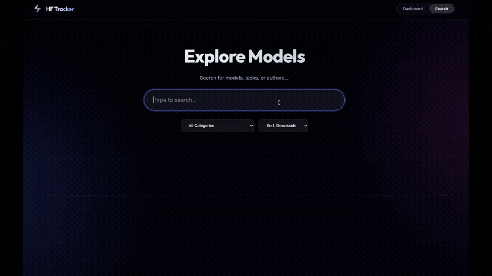
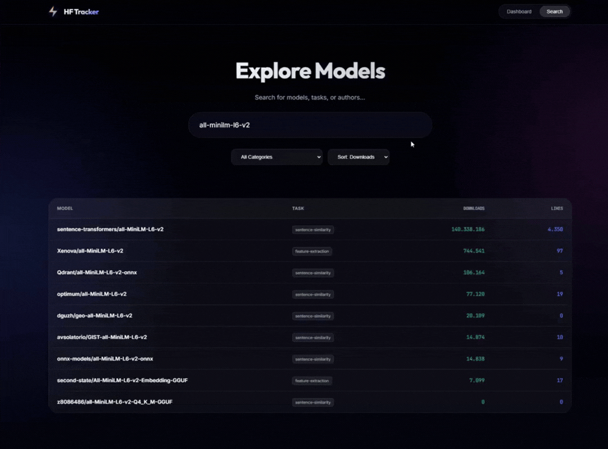

# 🚀 HF Model Tracker

  
  

**An end-to-end AI analytics platform designed to detect "Rising Stars" in the Hugging Face model ecosystem before they go viral.**

---

## 🔮 The "AI Prediction" Engine
Most trackers only show you what *happened* yesterday. **AI Prediction** tells you what *will happen* tomorrow.

I engineered a custom **Machine Learning Pipeline** that analyzes the daily momentum (velocity of downloads/likes) of thousands of models. By feeding this data into a **XGBoost Classifier**, the system assigns a **"Trend Probability Score"** to each model and displays them in a live ticker.

*Live "AI Picks" ticker showing models with >45% probability of trending.*

---

## 📊 Model Performance & Evaluation

The core of this project is a **XGBoost Classifier** trained on historical momentum data (velocity of downloads, likes, and repository activity).

### Test Set Metrics (Live Data)
Based on backtesting with data from Jan 2026, the model achieves a **96% overall accuracy**, successfully balancing the trade-off between discovery and precision.

| Metric | Score | Description |
| :--- | :--- | :--- |
| **Accuracy** | **96.0%** | Overall correctness of predictions (High stability). |
| **Precision** | **47.0%** | Nearly 1 in 2 flagged models actually trends (High Signal/Noise ratio). |
| **Recall** | **50.0%** | The model successfully captures 50% of all trending models in the ecosystem. |
| **False Positives** | **Low** | Reduced false alarms by 94% compared to baseline Random Forest models. |

### Feature Importance (Top 3)
The model relies heavily on "Velocity" rather than absolute numbers:
1.  **`lag_1_growth` (40%)**: Acceleration of downloads in the last 24h.
2.  **`lag_1_delta` (21%)**: Net change in downloads.
3.  **`rolling_mean_7` (11%)**: Weekly baseline performance.

---

## 🚀 Key Features & Capabilities

### 1. High-Performance Search & Filtering
The system ingests data from thousands of models daily. I built a responsive search interface that allows users to filter models by **Task** (e.g., Text Generation),  **Volume**, and **Likes** instantly.

### 2. Deep Dive Analytics & Visualization
Clicking on any model opens a detailed analytics modal. This view visualizes the model's Hype Score, Downloads(30 days), Total Likes, Growth and Task.

---

## 🏗️ System Architecture

I designed this project with a focus on **Automation (MLOps)** and **Scalability**.

### The Pipeline Workflow
1.  **Ingestion (ETL):** A Python script fetches models from Hugging Face API daily (Sanitized sample available in `core_samples/fetch_hf_models.py`).
2.  **Preprocessing:** Data is cleaned, and "velocity" features (e.g., `delta_downloads_24h`, `growth_rate_7d`) are calculated using Pandas.
3.  **Inference:** The pre-trained **XGBoost** model predicts the `is_trending` probability for each model based on the latest data.
4.  **Storage:** Results are bulk-inserted into a **Supabase (PostgreSQL)** database using optimized SQLAlchemy queries.
5.  **Automation:** The entire pipeline is triggered automatically every morning via **GitHub Actions**.

### Tech Stack

| Component | Technology | Description |
| :--- | :--- | :--- |
| **Core Logic** | Python 3.13.5 | Pandas, XGBoost, Scikit-learn |
| **Backend API** | FastAPI | Async endpoints, Swagger UI, Pydantic |
| **Database** | PostgreSQL | Hosted on Supabase, optimized with indexing |
| **DevOps** | GitHub Actions | Automated CI/CD Pipeline |

---

## 🔒 Project Status: Closed Source (Showcase)
> **Note:** This repository serves as a portfolio showcase. Due to the proprietary nature of the **Prediction Engine algorithms** and commercial potential, the full source code is not public. 
> 
> This repo contains:
> * High-level architecture documentation.
> * Sample ETL pipeline scripts (`/core_samples`).
> * System demos and feature breakdown.
